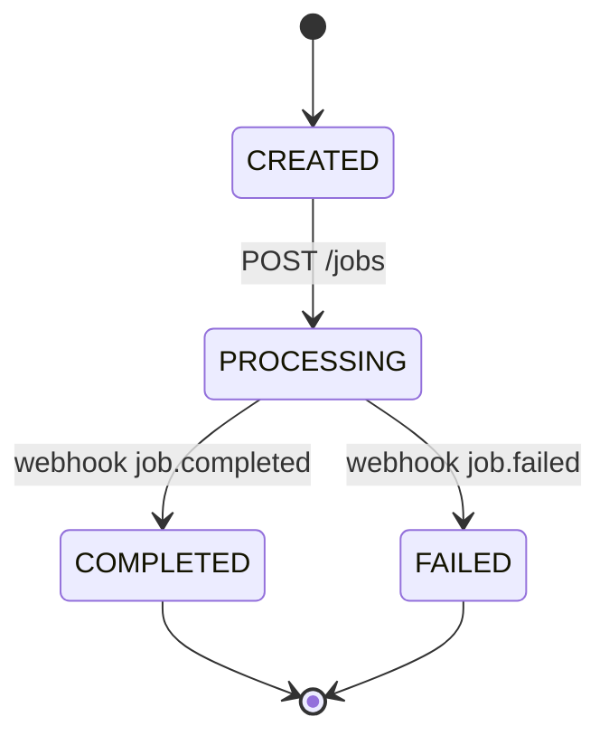
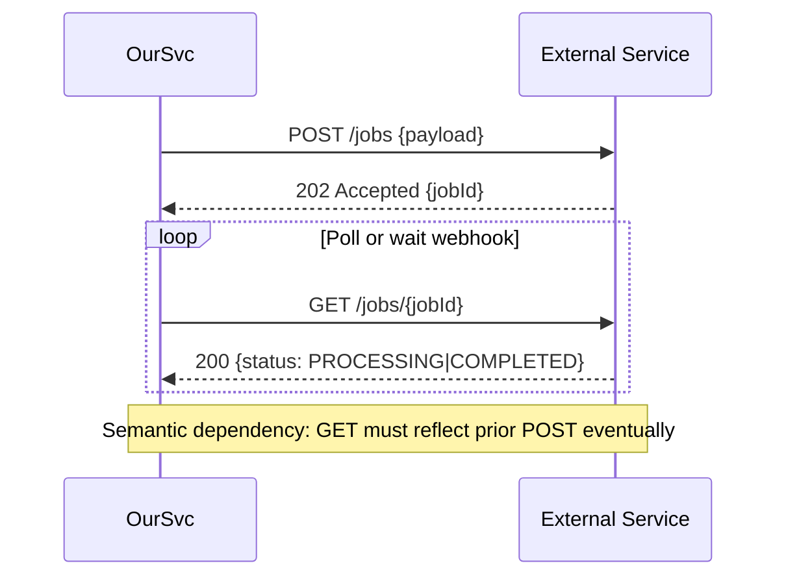

# 🔗 Integration Playbook Guide - Battle-Tested External Service Integration

**Objective**: Provide a repeatable, systematic process for integrating external services and dependencies with production-ready quality standards.

**Purpose**: Every external service integration must follow this playbook to ensure reliability, maintainability, and compliance with TDD and Code Complete 2 standards.

**When to Use**: Adding new external APIs, SDKs, webhooks, or any dependency that involves network calls, state synchronization, or semantic contracts.

---

## 🎯 Overview: Integration Excellence Framework

This playbook transforms integration work from ad-hoc coding to systematic engineering with:

- **Definition of Ready/Done** criteria for consistent quality gates
- **Context-Gap Mapping** to tackle unknowns systematically
- **Semantic dependency testing** for stateful API contracts
- **Production hardening** with resilience and observability
- **Documentation patterns** for maintainability

### Integration vs Internal Development

| Aspect            | Internal Code      | External Integration               |
| ----------------- | ------------------ | ---------------------------------- |
| **Control**       | Full               | Limited to API contract            |
| **Testing**       | Unit + Integration | Contract + Semantic + Resilience   |
| **Failures**      | Predictable        | Rate limits, timeouts, state drift |
| **Documentation** | Code comments      | README + Runbook + Troubleshooting |
| **Monitoring**    | Basic logging      | Request tracing + cost tracking    |

---

## 📋 Definition of Ready / Done

### 🚀 **Ready** (Before Coding)

- [ ] **Objective & success metrics** written with business context
- [ ] **Version(s) and environment(s)** chosen (SDK/REST; sandbox/prod)
- [ ] **Auth method** decided (keys/OAuth/JWT) + secrets path created
- [ ] **Data model + state transitions** sketched with sequence diagrams
- [ ] **Test matrix** drafted (happy, edge, failure, semantic)
- [ ] **Context-gap log** created with 3+ top unknowns prioritized

### ✅ **Done** (Exit Criteria)

- [ ] **All priority context gaps** closed or explicitly documented
- [ ] **Integration tests green** (happy path + critical edges)
- [ ] **Contract tests** for wire format & semantics green
- [ ] **Replayable "proof run"** recorded (request/response traces)
- [ ] **README updated** (quickstart + troubleshooting)
- [ ] **Runbook + rollback plan** in repo
- [ ] **Feature flag** off-by-default, rollout plan defined

---

## 🔄 The 11-Step Integration Process

### Step 1: Intake & Scoping (30–60 min)

**Purpose**: Define clear objectives and understand integration scope

**Artifact**: `integrations/<service>/00-scope.md`

```markdown
# Scope — <Service Name>

## Objective

Using `<Service X>`, our feature must `<do Y>` so that `<metric/goal>`.

## Primary APIs/Events

- POST /resources - Create new resource
- GET /resources/{id} - Retrieve resource status
- Webhook resource.completed - Async notification

## Semantic Dependencies

- A then B -> state=S; B returns expected result
- POST /resources -> state becomes PROCESSING
- Eventually webhook -> state becomes COMPLETED

## Constraints

- Rate limits: X requests/second
- Idempotency keys required for mutations
- Pagination: cursor-based or offset-based, max items per page

## Success Metrics

- P95 end-to-end latency < target threshold
- Error rate < acceptable threshold
- Success rate > target percentage
```

**Key Activities**:

- **Objective statement**: Clear cause→effect with business value
- **Critical behaviors**: List each API call and expected state change
- **Risk assessment**: Rate limits, async processing, costs, SLAs

### Step 2: Discovery & Context-Gap Mapping

**Purpose**: Systematically identify and close knowledge gaps

**Artifact**: `integrations/<service>/context-gaps.md`

```markdown
| #   | Area        | Unknown / Question                               | Priority | Hypothesis / Next Probe           | Owner | Status |
| --- | ----------- | ------------------------------------------------ | -------- | --------------------------------- | ----- | ------ |
| 1   | Semantics   | After POST /jobs, when is GET /jobs/<id> stable? | High     | Poll + state machine docs         | MK    | Open   |
| 2   | Versioning  | v3 SDK supports async webhooks?                  | Medium   | Compare v2 vs v3 change log       | Lea   | Open   |
| 3   | Rate limits | Burst policy on POST /events?                    | High     | Call 10/s in sandbox, inspect 429 | MK    | Open   |
```

**Key Activities**:

- **Official docs**: Read documentation + changelogs (pin exact versions)
- **Common breakages**: Search issues/StackOverflow (verify version parity)
- **Test environments**: Identify sandbox, mock server, recording tools

### Step 3: Architecture & State Thinking

**Purpose**: Model stateful/semantic flows early to prevent integration bugs

**Artifact**: `integrations/<service>/diagrams/state-and-sequence.md`





**Key Activities**:

- **State diagrams**: Map service states and transitions
- **Sequence diagrams**: Show temporal dependencies
- **Invariants**: Document expected behaviors and constraints

### Step 4: Environment, Auth, & Safety

**Purpose**: Secure configuration with production-ready safety measures

**Artifact**: `integrations/<service>/config.example.yaml`

```yaml
service:
  base_url: https://api.sandbox.example.com
  version: v3
  timeouts:
    connect_ms: 1000
    read_ms: 4000
  retry:
    max_attempts: 3
    backoff_ms: 200,400,800
  rate_limit:
    qps_cap: 8
auth:
  type: oauth_client_credentials
  token_url: https://auth.example.com/oauth/token
  scopes: ["jobs.write", "jobs.read"]
observability:
  structured_logs: true
  trace_spans: true
  cost_tracking: true
```

**Key Standards**:

- **Secrets**: In vault; never in code
- **Least-privilege**: Separate sandbox vs prod keys
- **Idempotency**: Required for non-GET calls
- **Timeouts/Retry/Backoff**: Sane defaults; avoid retry storms
- **Observability**: Structured logs with requestId/jobId; trace spans

### Step 5: Test Strategy (TDD-First)

**Purpose**: Comprehensive testing across all integration concerns

**Test Layers**:

1. **Unit** (pure): Our mapping/formatting functions
2. **Contract** (schema): Validate request/response shapes
3. **Semantic Integration** (stateful): Assert cause→effect across calls
4. **Resilience**: Retries, timeouts, 429s, 5xx, partial failures
5. **Performance Smoke**: Small load to see rate-limit behavior
6. **Webhooks**: Signature verification, replay protection, ordering

**Artifact**: `integrations/<service>/tests/test_semantics.py`

```python
@pytest.mark.integration
async def test_post_then_get_reflects_state(client, api_client, idempotency_key):
    """Semantic test: POST /resources must cause GET /resources/<id> to reflect state change."""
    # Arrange
    payload = make_valid_resource_payload()

    # Act 1: Create resource
    r1 = await api_client.post("/resources", json=payload,
                           headers={"Idempotency-Key": idempotency_key})
    assert r1.status_code in (200, 201, 202)
    resource_id = r1.json()["id"]

    # Act 2: Poll until stable state (semantic contract)
    status = await poll_until_stable(
        lambda: api_client.get(f"/resources/{resource_id}").json()["status"],
        until=lambda s: s in {"COMPLETED", "FAILED"},
        timeout_s=30
    )

    # Assert semantic contract
    assert status in {"COMPLETED", "FAILED"}

    # Contract validation for completed object
    if status == "COMPLETED":
        resource = await api_client.get(f"/resources/{resource_id}")
        validate_resource_response_schema(resource.json())
        assert resource.json()["result"]["outputUrl"]  # Business requirement
```

**Test Matrix Example**:

```markdown
| Case | Path                         | Expectation                      |
| ---- | ---------------------------- | -------------------------------- |
| H1   | POST /resources valid -> GET | Eventually COMPLETED with result |
| E1   | POST invalid payload         | 400 + error.code=VALIDATION      |
| R1   | Rapid POST x 20              | 429 within 2s, backoff respected |
| S1   | 5xx then retry               | Succeeds within 3 attempts       |
| W1   | Webhook signature bad        | 401 + event discarded            |
```

### Step 6: Spike → Thin Vertical Slice

**Purpose**: Implement minimal end-to-end path to validate assumptions

**Artifact**: `integrations/<service>/spike-notes.md` with curl examples

```bash
# Recorded proof run (sanitized)
curl -X POST "https://api.sandbox.example.com/v3/jobs" \
  -H "Authorization: Bearer $TOKEN" \
  -H "Idempotency-Key: test-123" \
  -H "Content-Type: application/json" \
  -d '{"input": "sample.pdf", "options": {"format": "text"}}'

# Response: {"id": "job_abc123", "status": "PROCESSING"}

# Poll until complete
curl "https://api.sandbox.example.com/v3/jobs/job_abc123" \
  -H "Authorization: Bearer $TOKEN"

# Final response: {"id": "job_abc123", "status": "COMPLETED", "result": {"artifactUrl": "..."}}
```

**Implementation**: One DTO, one POST, one GET/webhook, one mapper, one use-case
**Observability**: Wire logging and tracing around external calls
**Feature Flag**: Behind feature flag for safe deployment

### Step 7: Robustness & Semantics Hardening

**Purpose**: Production-ready resilience and semantic correctness

**Key Patterns**:

- **Idempotency**: Verify retried POST does not duplicate
- **Eventual consistency**: Poll with jitter, cap max wait; surface "PENDING" to callers
- **Rate limits**: Detect headers (X-RateLimit-\*) and adapt QPS
- **Pagination & partial responses**: Verify next-cursor logic
- **Clock skew**: Favor server timestamps; accept signed timestamp windows

```python
# Idempotency helper
def generate_idempotency_key(seed: str) -> str:
    """Generate deterministic idempotency key for external API calls."""
    return hashlib.sha256(seed.encode()).hexdigest()

# Retry with exponential backoff and jitter
async def with_retry_and_jitter(fn, max_attempts=3):
    """Retry with exponential backoff plus jitter to avoid thundering herd."""
    delay_ms = 200
    for attempt in range(1, max_attempts + 1):
        try:
            return await fn()
        except Exception as e:
            if attempt == max_attempts or not is_retryable_error(e):
                raise e

            jitter = random.randint(0, 100)
            await asyncio.sleep((delay_ms + jitter) / 1000)
            delay_ms *= 2
```

### Step 8: Documentation (README + Inline)

**Purpose**: High-level README for developers, inline comments for code context

**Artifact**: `integrations/<service>/README.md`

```markdown
# <Service> Integration

## Quickstart

1. Set secrets: `vault kv put secret/services/<service> api_key=...`
2. Run tests: `pytest tests/integrations/<service>/ -m integration`
3. Try it: `python demos/<service>_demo.py --file sample.json`

## Behaviors (Semantics)

- POST /jobs -> returns id, state becomes PROCESSING
- Webhook job.completed -> result available on GET /jobs/<id>
- Idempotency: Same key returns same job_id

## Troubleshooting

- 401: Check OAuth scope `jobs.write`
- 429: Reduce QPS; respect `Retry-After` header
- Stuck PROCESSING: Service delays up to 25s in sandbox environment

## Cost & Performance

- ~$0.01 per document processing job
- P95 latency: 2.3s end-to-end in production
- Rate limit: 10 QPS with burst to 20 QPS
```

**Inline Documentation**:

```python
async def create_job(self, payload: JobPayload) -> JobResponse:
    """Create processing job with semantic contract.

    SEMANTICS: Calling this method transitions remote state to PROCESSING.
    Expect eventual COMPLETED within ~30s in sandbox; poll with backoff.
    CONTRACT: See schema JobResponse v3.4.2 (pinned).
    IDEMPOTENCY: Same payload + idempotency key returns same job_id.
    """
```

### Step 9: Runbook & Rollback

**Purpose**: Operations guide for troubleshooting and incident response

**Artifact**: `integrations/<service>/RUNBOOK.md`

```markdown
# <Service> Integration Runbook

## Monitoring & Alerts

- **Dashboard**: https://grafana.company.com/d/<service>-integration
- **Key Metrics**: Request latency, error rate, 429 responses, cost per request
- **Alert Thresholds**: P95 > 5s, Error rate > 1%, Cost > $10/hour

## Common Failures & Fixes

### 401 Unauthorized

- **Symptom**: All requests returning 401
- **Root Cause**: Expired OAuth token or insufficient scopes
- **Fix**: Check token refresh logic; verify scopes include `jobs.write`

### 429 Rate Limited

- **Symptom**: Requests returning 429 with Retry-After header
- **Root Cause**: Exceeded QPS limit or burst bucket empty
- **Fix**: Implement exponential backoff; reduce concurrent requests

### Stuck in PROCESSING

- **Symptom**: Jobs remain PROCESSING beyond expected time
- **Root Cause**: External service delays or webhook failures
- **Fix**: Implement timeout + fallback polling; check webhook endpoint health

## Kill Switch & Rollback

- **Feature Flag**: `integrations.<service>.enabled` (default: false)
- **Disable**: Set flag to false in config management
- **Rollback**: Revert to previous commit; deploy with `deploy.sh --rollback`
- **Fallback**: Mock service available at `src/integrations/<service>/mock_service.py`
```

### Step 10: Compliance, Security, and Cost

**Purpose**: Production compliance and cost controls

**Security Checklist**:

- [ ] **Data classification**: PII/PHI/PCI identified and protected
- [ ] **Log scrubbing**: Secrets and sensitive payloads redacted
- [ ] **Retention**: Request/response samples have defined retention windows
- [ ] **Access control**: Least-privilege API keys and scopes

**Cost Controls**:

- [ ] **Budget alarms**: AWS Cost Management alerts for usage spikes
- [ ] **Request quotas**: Circuit breakers for runaway costs
- [ ] **Resource tagging**: Cost attribution per service and environment

### Step 11: Rollout Plan

**Purpose**: Safe, gradual deployment with monitoring

**Rollout Stages**:

1. **Dev sandbox**: Full integration testing
2. **Internal beta**: Team members only
3. **1% traffic**: Canary deployment with SLO monitoring
4. **10% → 50% → 100%**: Gradual rollout with abort thresholds

**SLO Watchers**:

- **Latency**: P95 < 5s (abort if > 10s)
- **Error rate**: < 1% (abort if > 5%)
- **Cost**: < $0.02 per request (abort if > $0.05)

---

## 🛠️ Integration Templates and Scaffolding

### GitHub Issue Template

Create: `.github/ISSUE_TEMPLATE/integration.yml`

```yaml
name: "Integration: External Service"
description: "Add or upgrade an external service integration"
title: "[INTG] <Service>: <Capability>"
labels: ["integration", "external", "tdd"]
body:
  - type: textarea
    id: objective
    attributes:
      label: Objective & Success Metrics
      description: What must this integration enable? How will we measure success?
  - type: input
    id: versions
    attributes:
      label: Versions / Environments
      description: API version, SDK, sandbox/prod URLs
  - type: textarea
    id: semantics
    attributes:
      label: Semantic Behaviors
      description: List cause→effect flows (A before B → expected state/result)
  - type: textarea
    id: risks
    attributes:
      label: Risks & Constraints
      description: Rate limits, costs, SLAs, data sensitivity
  - type: textarea
    id: test_matrix
    attributes:
      label: Test Matrix
      description: Happy path, edges, failures, rate limits, idempotency
  - type: textarea
    id: context_gaps
    attributes:
      label: Context-Gap Log (Top 3)
      description: Biggest unknowns to investigate first
```

### Folder Scaffold

```
integrations/
  <service>/
    00-scope.md
    context-gaps.md
    README.md
    RUNBOOK.md
    config.example.yaml
    diagrams/
      state-and-sequence.md
    schemas/
      job-response-v3.4.2.json
    src/
      client.py
      mappers.py
      models.py
      constants.py
    tests/
      test_contract.py
      test_semantics.py
      test_resilience.py
      test_performance.py
    demos/
      basic_demo.py
```

---

## 🔄 Daily Execution Loop

**While actively integrating**:

1. **Pull top context gap** → run **targeted probe** (small test or script)
2. **Update context-gaps.md** with what you learned
3. **Add/adjust tests** to codify the new understanding
4. **Keep spike vertical**; resist broadening scope
5. **Commit, PR, and pass** the PR checklist

**Commit Pattern**:

```
feat(integration): add <service> semantic contract tests

- Implement POST /jobs -> GET /jobs state validation
- Add idempotency key verification for duplicate requests
- Record proof run with sanitized request/response samples
- Update context-gaps.md with rate limit findings

Closes #123
```

---

## 🧪 Integration with TDD Workflow

### Development TDD for Integrations

**Use Development TDD when**:

- Building new integration from scratch
- Adding major new capabilities to existing integration
- Investigating production issues that require real service calls

```python
@pytest.mark.integration
@pytest.mark.live  # Calls real external service
async def test_end_to_end_resource_processing_workflow():
    """Development TDD: Real integration with real external service."""
    # Arrange: Real service configuration
    resource_processor = ResourceProcessingService(real_config, real_api_client)
    test_resource = load_test_data("sample_input.json")

    # Act: Real API calls to external service
    resource_response = await resource_processor.submit_resource(test_resource)
    completed_resource = await resource_processor.wait_for_completion(resource_response.resource_id)

    # Assert: Real response validation
    assert completed_resource.status == "COMPLETED"
    assert completed_resource.processed_data.output_field
    assert completed_resource.processed_data.result_count > 0
```

### Unit TDD for Integration Components

**Use Unit TDD when**:

- Testing request/response mapping logic
- Validating error handling and retry logic
- Testing configuration and initialization

```python
@pytest.mark.unit
def test_request_mapper_creates_valid_payload():
    """Unit TDD: Test request mapping with mocked external service."""
    # Arrange: Real mapper, mocked dependencies
    mapper = RequestMapper(config)
    mock_document = Mock(spec=Document)
    mock_document.content = b"PDF content"
    mock_document.filename = "test.pdf"

    # Act: Real mapping logic
    payload = mapper.create_job_payload(mock_document)

    # Assert: Validation without external calls
    assert payload["input_type"] == "pdf"
    assert payload["filename"] == "test.pdf"
    assert "options" in payload
```

---

## 📊 Success Metrics and Quality Gates

### Integration Quality Standards

| Metric                         | Threshold | Measurement                                |
| ------------------------------ | --------- | ------------------------------------------ |
| **Test Coverage**              | ≥95%      | All integration paths and error conditions |
| **Semantic Contract Coverage** | 100%      | All stateful API interactions tested       |
| **Error Recovery**             | ≥99%      | Automatic recovery from transient failures |
| **Documentation Completeness** | 100%      | README, Runbook, troubleshooting guide     |
| **Security Compliance**        | 100%      | Secrets management, data classification    |

### Performance Standards

| Metric                    | Target          | Monitoring                             |
| ------------------------- | --------------- | -------------------------------------- |
| **P95 Latency**           | < 5s            | End-to-end request/response time       |
| **Error Rate**            | < 1%            | Non-recoverable failures               |
| **Rate Limit Compliance** | 100%            | No 429 errors from poor QPS management |
| **Cost Efficiency**       | < $0.02/request | Total cost including retries           |

### Business Metrics

| Metric                       | Target        | Purpose                |
| ---------------------------- | ------------- | ---------------------- |
| **Mean Time to Integration** | < 2 weeks     | Playbook effectiveness |
| **Post-Integration Issues**  | < 1 per month | Integration quality    |
| **Developer Satisfaction**   | > 4.5/5       | Playbook usability     |

---

## 🎯 Integration with Existing Guidance

This Integration Playbook works seamlessly with our existing development practices:

### 📖 **Related Guides**

- **TDD_WORKFLOW_GUIDE.md**: Use Development TDD for integration tests, Unit TDD for component tests
- **TESTING_QUALITY_GUIDE.md**: Apply comprehensive testing patterns to integration scenarios
- **CODE_CONSTRUCTION_GUIDE.md**: Follow defensive programming for external service interactions
- **DEBUGGING_ERROR_HANDLING_GUIDE.md**: Use systematic debugging for integration failures
- **ARCHITECTURE_GUIDE.md**: Apply clean architecture patterns to integration clients

### 🔄 **Workflow Integration**

1. **Before starting**: Create integration issue using GitHub template
2. **During development**: Follow TDD practices with real external services
3. **Before merging**: Complete Definition of Done checklist
4. **After deployment**: Monitor using runbook procedures

### 📋 **Quality Assurance**

- All integrations must pass the same 95%+ test coverage requirements
- Integration documentation must meet README guidance standards
- All external service calls must have proper error handling and logging
- Security and compliance requirements apply to all external data flows

---

**🚀 This Integration Playbook transforms external service integration from risky, ad-hoc development into systematic, reliable engineering that scales with your team and business needs.**
