# 🎯 Design Investigation Guidance

This document provides a standardized framework for conducting thorough design investigations and architectural decision analysis. Use this guidance when evaluating technology choices, architectural patterns, or system design decisions that will have long-term impact on the project.

---

## 🎯 Investigation Philosophy

**Design investigations are evidence-based decision missions with leverage optimization.** Every design investigation should:

- **Start with leverage assessment** - Determine investigation depth based on decision impact
- **Maximize ROI at each tier** - Research prevents architectural mistakes, analysis prevents implementation rework
- **Apply escalation rules** - Route to appropriate investigation tier based on complexity and clarity
- **Define measurable criteria** - Establish objective evaluation metrics weighted by business impact
- **Gather evidence systematically** - Use benchmarks, prototypes, and research focused on highest-risk assumptions
- **Consider total cost of ownership** - Include development, operations, and maintenance costs over system lifetime
- **Document decision rationale** - Build institutional knowledge for future decisions and leverage optimization

---

## � Leverage Hierarchy in Design Investigations

**CRITICAL: Apply leverage hierarchy principles to maximize ROI of design investigation efforts.**

### 🎯 Investigation Leverage Tiers

**Research Tier (Highest Leverage)**

- **ROI**: 1 hour of design research = saves 100+ hours of wrong architectural implementation
- **Focus**: System understanding, requirement validation, constraint identification
- **When to Use**: Complex architectural decisions, infrastructure choices, technology stack selection
- **Output**: Clear problem definition, validated requirements, architectural constraints

**Analysis Tier (High Leverage)**

- **ROI**: 1 hour of comparative analysis = saves 50+ hours of implementation rework
- **Focus**: Option evaluation, evidence gathering, decision criteria application
- **When to Use**: Multiple viable options exist, trade-offs need quantification
- **Output**: Weighted decision matrix, evidence-based recommendations

**Implementation Planning Tier (Medium Leverage)**

- **ROI**: 1 hour of implementation planning = saves 10+ hours of development confusion
- **Focus**: Migration strategy, rollout planning, risk mitigation
- **When to Use**: After decision is made, before implementation begins
- **Output**: Detailed implementation roadmap, risk mitigation strategies

### 🎪 Leverage Escalation Rules

**Escalate to Research Tier when:**

- [ ] **Ambiguous Requirements**: Problem statement unclear or conflicting
- [ ] **Unknown Constraints**: Technical or business constraints not identified
- [ ] **Architecture Impact**: Decision affects fundamental system architecture
- [ ] **High Stakes**: Wrong decision could require major system rewrites

**Escalate to Analysis Tier when:**

- [ ] **Multiple Options**: More than 2 viable approaches identified
- [ ] **Complex Trade-offs**: Benefits and drawbacks need quantification
- [ ] **Team Expertise Gaps**: Options require skills outside team capabilities
- [ ] **Cost Implications**: Significant budget or operational cost differences

**Proceed to Implementation Planning when:**

- [ ] **Clear Winner**: Analysis shows obvious best choice
- [ ] **Validated Requirements**: Problem and constraints clearly understood
- [ ] **Risk Assessment**: Major risks identified and mitigation planned
- [ ] **Stakeholder Alignment**: Decision has appropriate approval and buy-in

### 💰 ROI Optimization Strategies

**Research Tier Optimization:**

- **Front-load Investigation**: Spend more time early to prevent late-stage architectural changes
- **Stakeholder Validation**: Confirm requirements with multiple perspectives before analysis
- **Constraint Discovery**: Actively seek hidden technical and business constraints
- **Future-proofing**: Consider 2-3 year technology evolution in research

**Analysis Tier Optimization:**

- **Evidence-Based Scoring**: Use quantitative metrics where possible for decision criteria
- **Proof of Concept Focus**: Build minimal prototypes for highest-risk assumptions only
- **Expert Consultation**: Leverage external expertise for unfamiliar technologies
- **Cost Model Accuracy**: Include all lifecycle costs, not just initial development

**Implementation Planning Optimization:**

- **Risk-First Planning**: Address highest-risk elements in implementation plan first
- **Rollback Strategy**: Always plan reversible implementation approaches
- **Incremental Delivery**: Break implementation into value-delivering increments
- **Learning Integration**: Build feedback loops into implementation plan

### 🧠 Leverage Decision Framework

**Use this framework to determine investigation depth:**

| Decision Impact | Requirements Clarity | Team Expertise | Investigation Approach                                    |
| --------------- | -------------------- | -------------- | --------------------------------------------------------- |
| **High**        | **Low**              | **Any**        | **Full Investigation** (Research → Analysis → Planning)   |
| **High**        | **High**             | **Low**        | **Analysis + Planning** (Skip to comparative analysis)    |
| **Medium**      | **Low**              | **Any**        | **Research + Planning** (Light analysis phase)            |
| **Medium**      | **High**             | **High**       | **Planning Only** (Quick validation then implement)       |
| **Low**         | **High**             | **High**       | **Direct Implementation** (Minimal investigation)         |
| **Any**         | **Low**              | **Any**        | **Research Required** (Never skip requirement validation) |

---

## �🔄 Design Investigation Flow

```mermaid
flowchart TD
    A[🎯 Business Requirements] --> B[📋 Decision Criteria Definition]
    B --> C[🔍 Option Identification & Research]
    C --> D[⚖️ Comparative Analysis Matrix]
    D --> E[🧪 Proof of Concept / Benchmarks]
    E --> F[📊 Evidence Synthesis]
    F --> G[🏆 Recommendation & Rationale]
    G --> H[📝 ADR Documentation]
    H --> I[🔄 Implementation Planning]

    style A fill:#e1f5fe
    style G fill:#c8e6c9
    style H fill:#fff3e0
```



---

## 📋 Design Investigation Template

### 0. Leverage Assessment & Investigation Scope

**Leverage Tier Determination:**

| Factor                   | Assessment                                 | Score (1-5) | Notes                                    |
| ------------------------ | ------------------------------------------ | ----------- | ---------------------------------------- |
| **Decision Impact**      | How many downstream systems affected?      | \_\_        | 1=Single module, 5=Entire architecture   |
| **Requirements Clarity** | How well understood is the problem?        | \_\_        | 1=Very unclear, 5=Crystal clear          |
| **Team Expertise**       | How familiar is team with options?         | \_\_        | 1=Completely new, 5=Deep expertise       |
| **Risk Level**           | What's the cost of wrong decision?         | \_\_        | 1=Easy to change, 5=Major rewrite needed |
| **Timeline Pressure**    | How much time available for investigation? | \_\_        | 1=Must decide today, 5=Plenty of time    |

**Investigation Approach** (based on leverage decision framework):

- [ ] **Full Investigation**: Research → Analysis → Planning (High impact, low clarity)
- [ ] **Analysis + Planning**: Comparative analysis → Implementation planning (High impact, clear requirements)
- [ ] **Research + Planning**: Requirement validation → Implementation planning (Medium impact, unclear requirements)
- [ ] **Planning Only**: Quick validation → Implementation planning (Medium impact, clear requirements, high expertise)
- [ ] **Direct Implementation**: Minimal investigation (Low impact, clear requirements, high expertise)

**Expected ROI:**

- **Investigation Time Investment**: [X hours]
- **Prevented Implementation Waste**: [Y hours]
- **ROI Multiplier**: [Y/X ratio]

---

### 1. Investigation Context & Scope

**Problem Statement:**  
_Clear description of the design problem or architectural decision to be made_

**Business Requirements:**  
_What the system must accomplish from a business perspective_

**Technical Requirements:**  
_Performance, scalability, reliability, security, and integration requirements_

**Constraints:**  
_Budget, timeline, team expertise, existing system limitations_

**Success Criteria:**  
_How will you know the right decision was made? Include measurable metrics_

---

### 2. Decision Criteria & Weights

**Create a weighted decision matrix with criteria important to your specific context:**

| Criteria Category | Weight (%) | Specific Criteria               | Measurement Method              |
| ----------------- | ---------- | ------------------------------- | ------------------------------- |
| **Performance**   | 25%        | Query response time, throughput | Benchmark tests                 |
| **Scalability**   | 20%        | Data volume, user growth        | Load testing, analysis          |
| **Development**   | 20%        | Team expertise, time to market  | Skill assessment                |
| **Operations**    | 15%        | Maintenance, monitoring         | Operational complexity analysis |
| **Cost**          | 10%        | Licensing, infrastructure       | TCO calculation                 |
| **Integration**   | 10%        | Existing systems, APIs          | Integration effort assessment   |

**Adjust weights based on your specific project priorities and constraints.**

---

### 3. Option Identification & Research

**For each option, gather comprehensive information:**

#### Option A: [Technology/Approach Name]

**Overview:**  
_Brief description of the technology/approach_

**Strengths:**

- Strength 1 with supporting evidence
- Strength 2 with supporting evidence
- Strength 3 with supporting evidence

**Weaknesses:**

- Weakness 1 with impact assessment
- Weakness 2 with impact assessment
- Weakness 3 with impact assessment

**Use Cases:**  
_When this option is typically recommended_

**Anti-patterns:**  
_When this option should be avoided_

**Research Sources:**

- Official documentation: [links]
- Industry benchmarks: [links]
- Case studies: [links]
- Expert opinions: [links]

#### Option B: [Technology/Approach Name]

_[Repeat structure for each option]_

#### Option C: [Technology/Approach Name]

_[Repeat structure for each option]_

---

### 4. Comparative Analysis Matrix

**Score each option (1-5, where 5 is best) against defined criteria:**

| Criteria              | Weight | Option A | Option B | Option C | Notes                                |
| --------------------- | ------ | -------- | -------- | -------- | ------------------------------------ |
| **Performance**       |        |          |          |          |                                      |
| - Query Response Time | 25%    | 4        | 3        | 5        | Benchmarks: A=50ms, B=100ms, C=20ms  |
| - Throughput          | 25%    | 3        | 4        | 4        | A=1k/sec, B=5k/sec, C=3k/sec         |
| **Scalability**       |        |          |          |          |                                      |
| - Data Volume         | 20%    | 5        | 3        | 4        | A=unlimited, B=100GB, C=1TB          |
| - User Growth         | 20%    | 4        | 3        | 5        | A=good, B=limited, C=excellent       |
| **Development**       |        |          |          |          |                                      |
| - Team Expertise      | 20%    | 3        | 5        | 2        | Team knows B well, A somewhat, C new |
| - Time to Market      | 20%    | 4        | 5        | 2        | B=fastest, A=medium, C=slowest       |
| **Operations**        |        |          |          |          |                                      |
| - Maintenance         | 15%    | 4        | 3        | 5        | C=self-managed, A=medium, B=high     |
| - Monitoring          | 15%    | 3        | 4        | 4        | Built-in monitoring capabilities     |
| **Cost**              |        |          |          |          |                                      |
| - Initial Setup       | 10%    | 5        | 4        | 3        | A=free, B=low, C=moderate            |
| - Ongoing             | 10%    | 4        | 3        | 3        | Monthly operational costs            |
| **Integration**       |        |          |          |          |                                      |
| - Existing Systems    | 10%    | 4        | 5        | 3        | Compatibility with current stack     |
| - APIs & Connectors   | 10%    | 3        | 4        | 5        | Available integrations               |

**Weighted Scores:**

- Option A: [Calculated weighted total]
- Option B: [Calculated weighted total]
- Option C: [Calculated weighted total]

---

### 5. Proof of Concept & Benchmarks

**Design focused experiments to validate key assumptions:**

#### Benchmark 1: [Performance Test]

**Objective:** _What are you testing?_  
**Method:** _How will you test it?_  
**Test Data:** _What data will you use?_  
**Environment:** _Test setup specifications_  
**Results:**

- Option A: [Results with metrics]
- Option B: [Results with metrics]
- Option C: [Results with metrics]
  **Analysis:** _What do these results mean?_

#### Benchmark 2: [Scalability Test]

_[Repeat structure for each critical test]_

#### Proof of Concept: [Integration Test]

**Objective:** _Test integration complexity and effort_  
**Implementation:** _Brief description of what was built_  
**Findings:**

- Integration effort: [hours/complexity rating]
- Compatibility issues: [any problems discovered]
- Developer experience: [ease of use assessment]

---

### 6. Evidence Synthesis & Risk Analysis

#### Key Findings Summary

**Performance Evidence:**  
_Summary of performance benchmark results_

**Scalability Evidence:**  
_Summary of scalability test results_

**Development Evidence:**  
_Summary of team capability and timeline assessments_

**Cost Evidence:**  
_Summary of total cost of ownership analysis_

#### Risk Assessment

**Option A Risks:**

- **High Risk:** [Risk description] - _Impact: High/Medium/Low, Probability: High/Medium/Low_
- **Medium Risk:** [Risk description] - _Impact: High/Medium/Low, Probability: High/Medium/Low_

**Option B Risks:**  
_[Repeat for each option]_

**Option C Risks:**  
_[Repeat for each option]_

#### Risk Mitigation Strategies

**For highest priority risks, define mitigation approaches:**

- **Risk:** [Description]
- **Mitigation:** [How to reduce probability or impact]
- **Contingency:** [What to do if risk materializes]

---

### 7. Recommendation & Rationale

#### Primary Recommendation: [Option Name]

**Recommendation:** _Choose Option X for this use case_

**Key Rationale:**

1. **[Primary Reason]:** [Evidence supporting this point]
2. **[Secondary Reason]:** [Evidence supporting this point]
3. **[Tertiary Reason]:** [Evidence supporting this point]

**Confidence Level:** High/Medium/Low  
**Decision Quality:** _How solid is the evidence base?_

#### Alternative Scenarios

**If circumstances change, consider alternatives:**

- **If budget becomes constrained:** Consider Option Y because [reason]
- **If timeline accelerates:** Consider Option Z because [reason]
- **If team expertise changes:** Re-evaluate based on new capabilities

#### Implementation Prerequisites

**Before implementing the recommended option:**

- [ ] Prerequisite 1: [What must be done first]
- [ ] Prerequisite 2: [What must be done first]
- [ ] Prerequisite 3: [What must be done first]

---

### 8. Decision Documentation (ADR)

**This investigation should result in an Architecture Decision Record (ADR) that includes:**

- **Context:** The situation requiring a decision
- **Decision:** What was decided and why
- **Consequences:** Expected benefits and trade-offs
- **Status:** Proposed/Accepted/Superseded
- **Review Date:** When to revisit this decision

**ADR Template Reference:** Use project ADR template with this investigation as evidence

---

### 9. Implementation Planning

#### Phase 1: Preparation ([Timeframe])

- [ ] Setup development environment
- [ ] Install dependencies and tools
- [ ] Configure development settings
- [ ] Create initial project structure

#### Phase 2: Core Implementation ([Timeframe])

- [ ] Implement core functionality
- [ ] Add integration points
- [ ] Configure production settings
- [ ] Implement monitoring and logging

#### Phase 3: Validation & Optimization ([Timeframe])

- [ ] Performance testing and optimization
- [ ] Security review and hardening
- [ ] Documentation completion
- [ ] Team training and knowledge transfer

---

### 10. Success Measurement & Monitoring

#### Success Metrics

**Define how you'll measure if the decision was correct:**

- **Performance Metrics:** [Specific KPIs to track]
- **Development Metrics:** [Developer productivity, bug rates]
- **Operational Metrics:** [Uptime, maintenance effort]
- **Business Metrics:** [User satisfaction, business outcomes]

#### Monitoring Plan

**What will you monitor post-implementation:**

- [ ] **Performance Dashboards:** [What metrics, how often]
- [ ] **Error Monitoring:** [What errors to track]
- [ ] **Usage Analytics:** [How the system is used]
- [ ] **Cost Tracking:** [Operational cost monitoring]

#### Review Schedule

**When to revisit this decision:**

- **6 months:** Initial performance review
- **1 year:** Comprehensive decision validation
- **Major changes:** Technology updates, requirement changes

---

## 🧰 Investigation Tools & Methods

### Research Methods

**Literature Review:**

- Official documentation and specifications
- Industry reports and whitepapers
- Academic research papers
- Community discussions and forums

**Expert Consultation:**

- Internal team expertise assessment
- External consultant input
- Community expert opinions
- Vendor technical discussions

**Hands-on Evaluation:**

- Proof of concept implementations
- Performance benchmarking
- Integration testing
- User experience assessment

### Benchmarking Tools

**Performance Testing:**

```bash
# Database query performance
time psql -c "SELECT COUNT(*) FROM large_table WHERE indexed_column = 'value'"

# API response time testing
curl -w "@curl-format.txt" -o /dev/null -s "http://api.example.com/endpoint"

# Load testing with Apache Bench
ab -n 1000 -c 10 http://localhost:8000/api/endpoint
```

**Resource Monitoring:**

```bash
# Memory and CPU usage
top -p $(pgrep process_name)

# Disk I/O monitoring
iostat -x 1

# Network monitoring
netstat -i 1
```

**Cost Analysis:**

- Total Cost of Ownership (TCO) calculators
- Cloud provider pricing calculators
- License cost aggregation
- Development time estimation

### Decision Support Tools

**Decision Matrix Calculator:**

```python
# Weighted decision matrix calculation
def calculate_weighted_score(scores, weights):
    return sum(score * weight for score, weight in zip(scores, weights))

options = {
    'Option A': [4, 3, 5, 4, 3],  # Scores for each criteria
    'Option B': [3, 4, 3, 5, 4],
    'Option C': [5, 4, 4, 3, 3]
}

weights = [0.25, 0.20, 0.20, 0.15, 0.20]  # Criteria weights

for option, scores in options.items():
    weighted_score = calculate_weighted_score(scores, weights)
    print(f"{option}: {weighted_score:.2f}")
```

---

## 🎯 Quality Assurance for Investigations

### Investigation Quality Checklist

**Leverage Optimization Quality:**

- [ ] **Appropriate Investigation Tier**: Investigation depth matches decision impact and requirements clarity
- [ ] **ROI Validation**: Expected time savings justify investigation investment
- [ ] **Escalation Rules Applied**: Properly escalated to research when requirements unclear
- [ ] **Tier Completion**: Each investigation tier completed before advancing to next
- [ ] **Quality Gates Passed**: Research findings validated before analysis, analysis complete before planning

**Evidence Quality:**

- [ ] **Multiple Sources:** Evidence from 3+ independent sources
- [ ] **Quantitative Data:** Objective measurements where possible
- [ ] **Recent Information:** Sources within last 2 years
- [ ] **Relevant Context:** Evidence applicable to your specific use case

**Analysis Quality:**

- [ ] **Bias Recognition:** Acknowledged potential biases in evaluation
- [ ] **Alternative Viewpoints:** Considered contrarian perspectives
- [ ] **Edge Cases:** Evaluated how options handle exceptional scenarios
- [ ] **Future Considerations:** Assessed long-term implications

**Decision Quality:**

- [ ] **Clear Rationale:** Decision logic is transparent and traceable
- [ ] **Risk Assessment:** Major risks identified and mitigation planned
- [ ] **Reversibility:** Understanding of how to change direction if needed
- [ ] **Success Metrics:** Clear definition of what success looks like

### Common Investigation Pitfalls

**Avoid These Mistakes:**

1. **Analysis Paralysis:** Don't over-research obvious decisions (use leverage framework to determine appropriate depth)
2. **Confirmation Bias:** Don't cherry-pick evidence supporting preconceptions
3. **Technology Hype:** Don't be swayed by marketing or trend following
4. **Sunk Cost Fallacy:** Don't stick with failing approaches due to previous investment
5. **Missing Context:** Don't ignore project-specific constraints and requirements
6. **Leverage Mismatch:** Don't under-investigate high-impact decisions or over-investigate low-impact ones
7. **Skipping Research:** Don't skip requirement validation when problem statement is unclear

---

## 🔗 Integration with Project Standards

### Leverage Hierarchy Integration

**Design investigations follow leverage hierarchy principles:**

- **Research Tier**: Validates system understanding and requirements before any architectural decisions
- **Analysis Tier**: Applies evidence-based evaluation to prevent implementation rework
- **Planning Tier**: Creates implementation roadmaps that protect development time investment
- **Quality Gates**: Each tier validates upstream work before proceeding to higher-leverage activities

### TDD Integration

**Apply TDD principles to design investigations:**

- **Write "test" criteria first** - Define success metrics before evaluation
- **Build small experiments** - Create minimal proof of concepts
- **Iterate and refine** - Use evidence to improve understanding
- **Document learnings** - Capture insights for future decisions

### Code Construction Integration

**Design investigations inform code construction:**

- **Architecture decisions** guide module design patterns
- **Technology choices** influence error handling strategies
- **Performance requirements** drive defensive programming approaches
- **Integration patterns** shape API and service designs

### Documentation Standards

**Investigation outputs must include:**

- **README updates** for new technologies or patterns
- **Architecture documentation** for significant design decisions
- **Troubleshooting guides** for operational considerations
- **Team training materials** for knowledge transfer

---

## 📚 Templates & Examples

### Quick Decision Template (Simple Choices)

For straightforward decisions with clear options:

```markdown
# Quick Decision: [Decision Topic]

## Context

[1-2 paragraphs describing the situation]

## Options

1. **Option A:** [Brief description]
2. **Option B:** [Brief description]

## Recommendation: Option X

**Rationale:** [2-3 key reasons with evidence]

## Implementation:\*\* [Key next steps]
```

### Full Investigation Template (Complex Decisions)

Use the complete template above for:

- Technology stack decisions
- Architecture pattern choices
- Database or infrastructure selections
- Tool and platform evaluations

### Research Investigation Template (Unknown Territory)

For decisions requiring significant research:

```markdown
# Research Investigation: [Topic]

## Knowledge Gaps

- [ ] Gap 1: [What we need to learn]
- [ ] Gap 2: [What we need to learn]

## Research Plan

1. **Literature Review:** [Sources to review]
2. **Expert Consultation:** [Who to talk to]
3. **Experiments:** [What to test]

## Findings

[Document discoveries and insights]

## Next Steps

[How findings influence decision making]
```

---

**Remember: Good design investigations balance thorough analysis with timely decision making. The goal is informed decisions, not perfect decisions. Document your reasoning so future decisions can build on current learning! 🎯📊✨**
