# 🧠 **Geist-Enhanced Design Investigation Framework**
*Applying Philosophical Analysis to Technical Decision-Making*

---

## 📚 **Framework Integration**

This document combines our **Leverage-Based Investigation Hierarchy** with the **Geist-Driven Development Framework** to create a comprehensive approach to design investigations that maximizes ROI while uncovering hidden complexities.

### **Core Philosophy**
- **Leverage Optimization**: Focus investigation effort where it has maximum impact
- **Ghost Analysis**: Uncover parallel realities and unknown unknowns
- **Geyser Management**: Anticipate and channel forces of change
- **Gist Extraction**: Maintain focus on essential core problems

---

## 🎯 **Enhanced Investigation Leverage Tiers**

### **Research Tier (Highest Leverage) + Ghost Analysis**
**ROI**: 1 hour of research = saves 100+ hours of wrong implementation
**Enhanced Focus**: System understanding + parallel reality mapping

```typescript
interface GhostEnhancedResearch {
  traditionalResearch: {
    requirementValidation: "What the system must accomplish";
    constraintIdentification: "Budget, timeline, technical limitations";
    optionSurvey: "Available approaches and technologies";
  };
  
  ghostAnalysis: {
    parallelReality: "What should the system become vs what we're planning?";
    hiddenRequirements: "What requirements exist but aren't visible yet?";
    unstatedAssumptions: "What are we assuming that might not be true?";
    unknownUnknowns: "What don't we know that we don't know?";
  };
}
```

### **Analysis Tier (High Leverage) + Geyser Forces**
**ROI**: 1 hour of analysis = saves 50+ hours of implementation rework
**Enhanced Focus**: Option evaluation + dynamic force management

```typescript
interface GeyserEnhancedAnalysis {
  traditionalAnalysis: {
    optionComparison: "Weighted decision matrix of approaches";
    tradeoffQuantification: "Measurable benefits and drawbacks";
    evidenceGathering: "Benchmarks, prototypes, expert input";
  };
  
  geyserAnalysis: {
    expansionForces: "How will requirements grow beyond initial scope?";
    emergentBehaviors: "What behaviors will emerge from system interactions?";
    changeForces: "What business/technology shifts will impact this?";
    pressurePoints: "Where will the system feel growth pressure?";
  };
}
```

### **Implementation Tier (Medium Leverage) + Gist Focus**
**ROI**: 1 hour of planning = saves 10+ hours of development confusion
**Enhanced Focus**: Implementation strategy + essential core preservation

```typescript
interface GistEnhancedImplementation {
  traditionalPlanning: {
    migrationStrategy: "How to transition from current to target state";
    rolloutPlanning: "Phased implementation approach";
    riskMitigation: "Contingency plans for known risks";
  };
  
  gistAnalysis: {
    coreEssence: "What is the irreducible problem being solved?";
    essentialConstraints: "What cannot be compromised?";
    simplicityPreservation: "How to maintain core focus during implementation?";
    valueDelivery: "What is the minimal viable core that still works?";
  };
}
```

---

## 🔄 **Geist-Enhanced Investigation Flow**

```mermaid
flowchart TD
    A[🎯 Business Requirements] --> B[👻 Ghost Discovery Session]
    B --> C[📋 Enhanced Decision Criteria]
    C --> D[🔍 Option Research + Parallel Reality Mapping]
    D --> E[🌋 Geyser Force Analysis]
    E --> F[⚖️ Comparative Analysis Matrix]
    F --> G[🧪 Proof of Concept + Pressure Testing]
    G --> H[💎 Gist Extraction & Core Focus]
    H --> I[📊 Evidence Synthesis]
    I --> J[🏆 Recommendation & Rationale]
    J --> K[📝 ADR Documentation]
    K --> L[🔄 Implementation Planning]

    style A fill:#e1f5fe
    style B fill:#f3e5f5
    style E fill:#fff3e0
    style H fill:#e8f5e8
    style J fill:#c8e6c9
```



---

## 📋 **Geist-Enhanced Investigation Template**

### 0. Leverage Assessment & Geist Scope

**Investigation Approach Determination:**

| Factor | Traditional Assessment | Geist Enhancement | Score (1-5) |
|--------|----------------------|-------------------|-------------|
| **Decision Impact** | Downstream systems affected | + Parallel reality implications | ___ |
| **Requirements Clarity** | Problem understanding | + Hidden requirement discovery | ___ |
| **Unknown Complexity** | Known technical risks | + Ghost analysis needed | ___ |
| **Change Forces** | Static requirements | + Geyser pressure assessment | ___ |
| **Core Focus Risk** | Implementation complexity | + Gist extraction importance | ___ |

**Enhanced Investigation Approach:**
- [ ] **Full Geist Investigation**: Ghost → Geyser → Gist → Traditional Analysis
- [ ] **Geyser + Analysis**: Force analysis → Comparative evaluation
- [ ] **Ghost + Planning**: Unknown discovery → Implementation strategy
- [ ] **Gist + Planning**: Core extraction → Focused implementation
- [ ] **Traditional Only**: Standard investigation approach

---

### 1. Ghost Discovery Session (30-60 minutes)

**Parallel Reality Mapping:**
```markdown
## Current Planning vs Ghost Reality

**What We Think We're Building:**
[Current understanding of requirements and solution]

**Ghost Reality - What System Needs to Become:**
[Ideal state that exists alongside current planning]

**Parallel State Gaps:**
- [ ] User experience gaps between planned and ideal
- [ ] Business logic assumptions that may be wrong
- [ ] Technical architecture assumptions to validate
- [ ] Integration complexities not yet visible
```

**Unknown Unknown Excavation:**
```markdown
## Systematic Unknown Discovery

**System Interaction Unknowns:**
- What systems will this interact with that we haven't considered?
- How will existing systems behave when this is introduced?
- What data flows exist that we haven't mapped?

**Scale Implication Unknowns:**
- What happens when this scales 10x beyond current vision?
- What performance characteristics will emerge under load?
- How will user behavior change as system grows?

**User Adaptation Unknowns:**
- How will users adapt this system to unexpected use cases?
- What workflows will emerge that we haven't anticipated?
- What support needs will develop that we haven't planned for?

**Technical Debt Unknowns:**
- What maintenance overhead will accumulate invisibly?
- What integration points will become brittle over time?
- What security vulnerabilities might emerge as system evolves?
```

**Context Gap Analysis:**
```markdown
## Hidden Context Discovery

**Business Logic Gaps:**
- What business rules exist but aren't documented?
- What approval workflows are assumed but not explicit?
- What compliance requirements haven't been surfaced?

**Data Relationship Gaps:**
- What data dependencies exist that we haven't mapped?
- What data quality issues will surface under real usage?
- What reporting needs exist that we haven't considered?

**Workflow Dependency Gaps:**
- What manual processes currently bridge system gaps?
- What timing dependencies exist between system components?
- What error handling workflows are assumed but not designed?
```

---

### 2. Geyser Force Analysis (45 minutes)

**Expansion Force Mapping:**
```markdown
## Dynamic Forces Assessment

**Feature Growth Pressures:**
- How will initial features expand beyond current scope?
- What feature requests will emerge from early usage?
- How will success create pressure for additional capabilities?

**User Base Growth Implications:**
- How will growing user base create new system pressures?
- What support and training needs will scale with users?
- How will user diversity create new requirement categories?

**Data Volume Expansion:**
- How will increasing data volume impact system performance?
- What storage and processing needs will grow over time?
- How will data complexity increase with system maturity?

**Integration Demand Evolution:**
- What new integration requests will emerge as system proves valuable?
- How will API usage patterns evolve beyond initial design?
- What third-party system changes might impact our integrations?
```

**Emergent Property Prediction:**
```markdown
## System Behavior Emergence

**Component Interaction Behaviors:**
- What behaviors will emerge from component interactions?
- How will system complexity create unexpected behaviors?
- What feedback loops will develop between system parts?

**User Pattern Evolution:**
- What usage patterns will emerge that create new requirements?
- How will user expertise growth change system usage?
- What community behaviors will develop around the system?

**Performance Bottleneck Prediction:**
- Where will performance issues emerge under growth pressure?
- What resource constraints will become critical first?
- How will system architecture limits manifest under load?
```

**Change Force Management:**
```markdown
## Pressure Management Strategy

**Flexibility Architecture:**
- How can system architecture accommodate unknown future needs?
- What configuration options should be built in from start?
- How can system behavior be modified without code changes?

**Pressure Release Valves:**
- What mechanisms will handle unexpected load or usage?
- How can system gracefully degrade under pressure?
- What manual overrides should be available for edge cases?

**Force Channeling Strategy:**
- How can growth energy be channeled into system improvement?
- What feedback mechanisms will turn user growth into better features?
- How can scale pressures drive efficiency improvements?
```

---

### 3. Gist Extraction & Core Focus (30 minutes)

**Essential Problem Definition:**
```markdown
## Core Problem Distillation

**The ONE Fundamental Problem:**
[Single sentence describing the irreducible problem being solved]

**Irreducible Value Proposition:**
[What value cannot be removed without destroying the purpose]

**Essential User Interactions:**
[What interactions are absolutely necessary for core value delivery]

**Minimal Viable Core:**
[Smallest implementation that still solves the fundamental problem]
```

**Essential Constraint Mapping:**
```markdown
## Non-Negotiable Requirements

**Physical/Technical Limits:**
- What are the hard limits we absolutely cannot overcome?
- What performance requirements are truly non-negotiable?
- What integration constraints cannot be worked around?

**Logical Requirements:**
- What business logic absolutely cannot be compromised?
- What data integrity requirements are fundamental?
- What security requirements are essential vs nice-to-have?

**User Fundamentals:**
- What user needs are absolutely core to solving the problem?
- What user experience elements are essential vs convenient?
- What user workflows cannot be eliminated or significantly changed?
```

**Simplicity Preservation Strategy:**
```markdown
## Core Focus Maintenance

**Essence Protection Plan:**
- How will we protect core functionality during feature expansion?
- What principles will guide feature addition decisions?
- How will we prevent feature creep from obscuring core value?

**Complexity Management:**
- What complexity is essential vs accidental?
- How will we maintain simple core use cases as system grows?
- What mechanisms will preserve ease of use for basic functionality?

**Value Delivery Optimization:**
- How will users discover core value within first interaction?
- What is the shortest path from user need to value delivery?
- How can we optimize for the 80% use case while supporting the 20%?
```

---

### 4. Enhanced Decision Criteria & Analysis

**Geist-Enhanced Decision Matrix:**

| Criteria Category | Weight | Traditional Criteria | Geist Enhancement | Measurement |
|------------------|--------|---------------------|-------------------|-------------|
| **Core Value** | 25% | Feature completeness | Gist alignment & simplicity preservation | Core use case completion time |
| **Adaptability** | 20% | Technical flexibility | Ghost unknown handling + Geyser pressure management | Configuration options & extensibility points |
| **Growth Readiness** | 20% | Scalability metrics | Geyser force accommodation | Performance under 10x load scenarios |
| **Implementation Risk** | 15% | Technical complexity | Ghost unknown mitigation | Unknown discovery and mitigation strategies |
| **User Experience** | 10% | Usability metrics | Parallel reality alignment | Gap between planned and ideal user experience |
| **Maintenance** | 10% | Code maintainability | Gist preservation over time | Core functionality protection mechanisms |

---

### 5. Geist-Aware Implementation Planning

**Ghost Mitigation Strategy:**
```markdown
## Unknown Unknown Management

**Discovery Mechanisms:**
- How will we continue discovering unknowns during implementation?
- What feedback loops will surface hidden requirements?
- How will we validate assumptions throughout development?

**Assumption Testing Plan:**
- What are our highest-risk assumptions to test first?
- How will we validate parallel reality alignment?
- What user research will confirm or refute our ghost analysis?

**Context Gap Filling:**
- What research is needed to fill identified context gaps?
- Who are the domain experts we need to consult?
- What documentation needs to be created to capture discovered context?
```

**Geyser Pressure Preparation:**
```markdown
## Change Force Accommodation

**Expansion Architecture:**
- How will system architecture accommodate identified growth forces?
- What flexibility mechanisms need to be built from the start?
- How will we handle the top 3 predicted expansion pressures?

**Pressure Monitoring:**
- What metrics will indicate when geyser forces are building?
- How will we detect emergent behaviors early?
- What early warning systems will alert us to unexpected pressures?

**Force Channeling Implementation:**
- How will we channel growth energy into system improvements?
- What mechanisms will turn user feedback into feature priorities?
- How will scale pressures drive optimization efforts?
```

**Gist Preservation Plan:**
```markdown
## Core Focus Maintenance

**Essence Protection Mechanisms:**
- How will we ensure core functionality remains simple as system grows?
- What governance will prevent feature creep from obscuring core value?
- How will we maintain the shortest path to value delivery?

**Simplicity Metrics:**
- How will we measure whether core use cases remain simple?
- What metrics will indicate when complexity is harming core value?
- How will we track user success with fundamental functionality?

**Value Delivery Optimization:**
- How will we continuously optimize the core user experience?
- What mechanisms will ensure new features enhance rather than complicate core flows?
- How will we validate that essential problem solving remains effective?
```

---

## 🧪 **Geist-Enhanced Debugging Protocol**

### **When Investigation Gets Stuck**

**The Three-Question Debug Protocol:**

1. **Ghost Question**: *"What parallel reality am I not seeing?"*
   - What assumptions am I making about requirements that might be wrong?
   - What context am I missing about how this system should really work?
   - What unknown unknowns might be affecting my analysis?

2. **Geyser Question**: *"What forces are at play that I'm not accounting for?"*
   - What growth or change pressures are creating complexity I'm not seeing?
   - How are things expanding or evolving in ways I didn't expect?
   - What emergent behaviors are creating unexpected requirements?

3. **Gist Question**: *"Am I solving the essential problem or getting distracted?"*
   - What is the core issue I'm actually trying to solve with this investigation?
   - Am I overcomplicating an analysis that should focus on simpler fundamentals?
   - Does this investigation approach serve the fundamental decision-making need?

---

## 📊 **Weekly Geist Review for Ongoing Projects**

```markdown
## Weekly Investigation Health Check (15 minutes)

### Ghost Check (5 min)
- What unknowns did we discover this week in our investigation?
- What assumptions were validated or invalidated?
- What context gaps did we fill or newly identify?
- What parallel realities emerged that we need to consider?

### Geyser Assessment (5 min)
- What expansion pressures or change forces did we encounter?
- How are requirements or constraints evolving during our investigation?
- What new forces are building that need attention in our analysis?
- How well are our investigation methods handling dynamic changes?

### Gist Verification (5 min)
- Are we still focused on the essential decision that needs to be made?
- Did we add analytical complexity that doesn't serve the core decision?
- How clean is our path from investigation to actionable recommendation?
- What can we simplify in our approach without losing decision quality?
```

---

This enhanced framework transforms design investigations from purely technical exercises into philosophical explorations that uncover hidden complexities, anticipate change forces, and maintain focus on essential problems while maximizing the ROI of investigation effort.