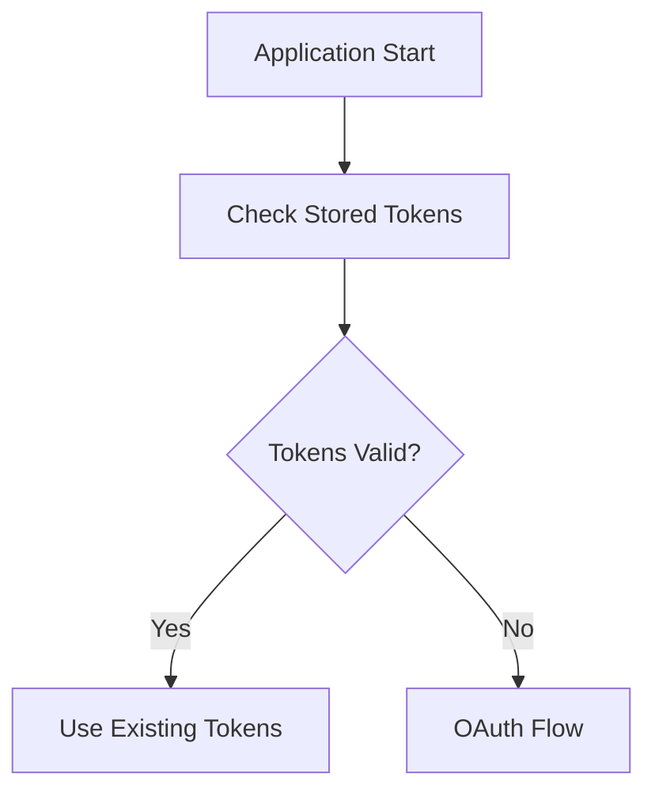
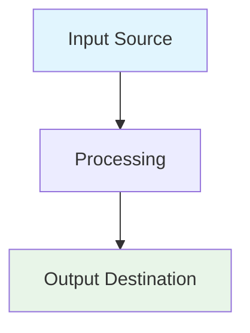

# README Documentation Guidance

## 📋 Overview

**This guide establishes comprehensive standards for README file creation, maintenance, and updates across the LangGraph project. README files serve as the primary entry point for understanding modules, services, and functionality.**

**Key Principles:**

- **Documentation-First**: README files should be created BEFORE implementation begins
- **Living Documentation**: READMEs must be updated with every significant code change
- **Self-Contained**: Each README should provide complete context for its scope
- **Business Context**: Include WHY decisions were made, not just WHAT was implemented

---

## 🎯 When to Create/Update README Files

### ✅ MANDATORY README Creation

**Create README files for:**

- **New directories/modules** - Before adding any code files
- **Service implementations** - Document business logic and interfaces
- **Integration clients** - Cover API patterns and authentication
- **Workflow steps** - Explain step purpose and data flow
- **Testing directories** - Document test organization and execution
- **Configuration directories** - Explain settings and environment setup

### 🔄 MANDATORY README Updates

**Update README files when:**

- **Adding new functionality** - Document new features and interfaces
- **Changing API interfaces** - Update examples and usage patterns
- **Modifying configuration** - Update environment variables and settings
- **Refactoring architecture** - Update architectural diagrams and patterns
- **Adding dependencies** - Document new requirements and setup steps
- **Changing deployment** - Update deployment and running instructions

### 🏷️ Top-Level README Updates

**Update main project README for:**

- **New major features** - Add to feature overview
- **Deployment changes** - Update setup and running instructions
- **New integrations** - Document external service additions
- **Architecture changes** - Update system overview
- **New development workflows** - Update developer onboarding
- **Dependency changes** - Update installation requirements

---

## 🏗️ README Structure Standards

### 📑 Standard README Template

```markdown
# [Module/Service Name]

## 📋 Overview

Brief description of purpose and business context. Include WHY this exists.

## 🏗️ Architecture

High-level architecture diagram and design patterns used.

### Key Components

- **Component 1**: Purpose and responsibility
- **Component 2**: Purpose and responsibility

## 📁 Directory Structure
```

module_name/
├── **init**.py
├── main_service.py # Primary business logic
├── models/ # Data models and schemas
│ ├── **init**.py
│ └── entities.py
├── interfaces/ # External service interfaces
│ ├── **init**.py
│ └── api_client.py
└── utils/ # Shared utilities
├── **init**.py
└── helpers.py

````

## 🚀 Getting Started

### Prerequisites

- Python 3.11+
- Required environment variables
- External service dependencies

### Installation

```bash
# Installation steps
````

### Basic Usage

```python
# Code examples showing primary use cases
```

## 📖 Detailed Usage

### [Feature/Component 1]

Business context and detailed examples.

```python
# Comprehensive code examples
```

### [Feature/Component 2]

Business context and detailed examples.

## ⚙️ Configuration

### Environment Variables

```bash
# Required configuration
REQUIRED_VAR=value

# Optional configuration
OPTIONAL_VAR=default_value
```

### Configuration Files

Document any config files and their structure.

## 🧪 Testing

### Running Tests

```bash
# Test execution commands
```

### Test Organization

- Unit tests: Location and purpose
- Integration tests: Location and purpose
- Test fixtures: Shared test data

## 🔧 Development

### Adding New Features

1. Step-by-step development process
2. Testing requirements
3. Documentation updates needed

### Common Patterns

Document reusable patterns and best practices.

## 📊 Monitoring and Observability

### Metrics

- Key metrics tracked
- Performance indicators

### Logging

- Log structure and levels
- Key events logged

## 🐛 Troubleshooting

### Common Issues

- Issue 1: Description and solution
- Issue 2: Description and solution

### Debugging

- Debug techniques
- Common error patterns

## 🔗 Dependencies

### Core Dependencies

```
package>=version    # Purpose/usage
```

### Optional Dependencies

```
optional-package>=version    # Purpose/usage
```

## 🔄 Future Enhancements

- Planned features
- Technical debt items
- Architectural improvements

````

### 🎯 README Quality Checklist

**Before Publishing README:**

- [ ] **Business context explained** - WHY this exists
- [ ] **Architecture documented** - High-level design patterns
- [ ] **Complete usage examples** - Working code samples
- [ ] **Configuration documented** - All environment variables
- [ ] **Dependencies listed** - With versions and purposes
- [ ] **Testing instructions** - How to run and verify
- [ ] **Troubleshooting section** - Common issues and solutions
- [ ] **Future enhancements** - Planned improvements

---

## 📝 Content Standards

### 🎯 Writing Style

**Business Context First:**

```markdown
# ❌ Poor Example
## Email Service
Processes emails using Gmail API.

# ✅ Good Example
## Email Processing Service
Automates invoice and receipt processing by retrieving emails with PDF attachments from Gmail, enabling hands-off expense tracking and financial data collection.
````

**Technical Details with Purpose:**

```markdown
# ❌ Poor Example

Uses OAuth 2.0 for authentication.

# ✅ Good Example

Implements Google OAuth 2.0 with automatic token refresh to ensure uninterrupted access to Gmail and Sheets APIs, preventing manual re-authentication during automated processing runs.
```

### 🔗 Cross-References

**Link to Related Documentation:**

```markdown
## Related Documentation

- **Architecture Overview**: `../ARCHITECTURE_GUIDE.md`
- **Testing Patterns**: `../TESTING_QUALITY_GUIDE.md`
- **Service Integration**: `../integrations/README.md`
- **Workflow Steps**: `../workflow/steps/README.md`
```

### 📊 Visual Documentation

**Include Diagrams for Complex Flows:**

````markdown
## Authentication Flow


````

````

### 🏷️ Code Examples Standards

**Complete, Runnable Examples:**

```python
# ✅ Good Example - Complete Context
from integrations.gmail import GmailClient
from services.extraction import DocumentProcessor

async def process_invoices():
    """Complete example of invoice processing workflow."""
    # Initialize services with configuration
    gmail = GmailClient()
    processor = DocumentProcessor()

    # Search for unprocessed emails
    emails = await gmail.search_emails(
        query="has:attachment filename:pdf -label:processed",
        max_results=10
    )

    # Process each email
    for email in emails:
        attachments = await gmail.get_attachments(email.id)
        for attachment in attachments:
            if attachment.filename.endswith('.pdf'):
                # Extract and process document
                content = await gmail.download_attachment(attachment)
                result = await processor.extract_invoice_data(content)

                # Mark as processed
                await gmail.add_label(email.id, 'processed')

    return len(emails)

# Usage
if __name__ == "__main__":
    import asyncio
    processed_count = asyncio.run(process_invoices())
    print(f"Processed {processed_count} emails")
````

---

## 🔄 README Maintenance Workflow

### 📋 Pre-Implementation

**Before Starting New Feature/Module:**

1. **Create README structure** - Use standard template
2. **Document business requirements** - WHY this is needed
3. **Design architecture section** - High-level approach
4. **Plan usage examples** - How it will be used
5. **Identify dependencies** - What's needed to implement

### 🛠️ During Implementation

**As You Build:**

1. **Update usage examples** - Keep code samples current
2. **Document configuration** - Add new environment variables
3. **Update architecture** - Reflect actual implementation
4. **Add troubleshooting** - Document issues encountered
5. **Test examples** - Ensure all code samples work

### ✅ Post-Implementation

**Before Marking Complete:**

1. **Review completeness** - Use quality checklist
2. **Test all examples** - Verify they execute successfully
3. **Update cross-references** - Link to related documentation
4. **Add monitoring info** - Document metrics and logging
5. **Plan future enhancements** - Document technical debt

### 🔍 Regular Maintenance

**Monthly README Review:**

1. **Verify examples work** - Test with current codebase
2. **Update dependencies** - Check for version changes
3. **Review troubleshooting** - Add new common issues
4. **Check cross-references** - Ensure links are valid
5. **Update architecture** - Reflect any changes

---

## 🎨 Module-Specific README Patterns

### 🔌 Integration Module README

**Required Sections:**

- **Authentication Setup** - OAuth flows and token management
- **API Client Patterns** - Standard interface implementations
- **Error Handling** - Retry logic and circuit breakers
- **Rate Limiting** - Quota management and throttling
- **Testing Strategy** - Mock patterns for external services

````markdown
## Authentication

### OAuth 2.0 Setup

```python
from integrations.auth import GoogleOAuthClient

# Initialize with required scopes
oauth = GoogleOAuthClient(scopes=[
    'https://www.googleapis.com/auth/gmail.readonly',
    'https://www.googleapis.com/auth/spreadsheets'
])

# Authenticate (handles token storage/refresh)
credentials = await oauth.authenticate()
```
````

### Error Handling

```python
from integrations.gmail import GmailClient
from integrations.exceptions import QuotaExceededError, AuthenticationError

try:
    gmail = GmailClient()
    emails = await gmail.search_emails("query")
except QuotaExceededError:
    # Implement backoff strategy
    await asyncio.sleep(60)
    # Retry with exponential backoff
except AuthenticationError:
    # Re-authenticate
    await oauth.refresh_credentials()
```

````

### 🔧 Service Module README

**Required Sections:**

- **Business Logic Overview** - What business problems this solves
- **Service Interface** - Standard patterns and base classes
- **Data Flow** - How data moves through the service
- **Configuration** - Business rules and settings
- **Performance Considerations** - Caching and optimization

```markdown
## Business Logic

### Invoice Categorization

Automatically categorizes expenses based on vendor patterns and business rules to enable accurate financial reporting and budget tracking.

```python
from services.analysis import CategorizationService

categorizer = CategorizationService()

# Categorize based on vendor and description
result = await categorizer.process({
    'vendor': 'Office Depot',
    'description': 'Printer supplies and paper',
    'amount': 156.78
})

# Returns structured categorization
{
    'category': 'Office Supplies',
    'subcategory': 'Printing',
    'confidence': 0.94,
    'business_justification': 'Vendor pattern match + keyword analysis',
    'suggested_tags': ['office', 'printing', 'supplies']
}
````

### Performance Optimization

```python
# Batch processing for efficiency
results = await categorizer.batch_process([
    {'vendor': 'Vendor1', ...},
    {'vendor': 'Vendor2', ...},
    # ... up to 100 items
])

# Caching for repeated categorizations
categorizer.enable_cache(ttl_seconds=3600)
```

````

### 🔄 Workflow Step README

**Required Sections:**

- **Step Purpose** - Business context and workflow position
- **Input/Output Contracts** - Data structures and schemas
- **Dependencies** - External services and previous steps
- **Error Handling** - Step-specific failure modes
- **Monitoring** - Step-specific metrics and logging

```markdown
## Step Purpose

### Business Context

Extracts structured invoice data from PDF attachments to enable automated expense tracking and financial reporting without manual data entry.

### Workflow Position

```mermaid
graph LR
    A[Extract Text] --> B[Classify Document] --> C[Extract Invoice Data] --> D[Analyze Data]
````

## Input/Output Contracts

### Input Schema

```python
from models.state import DocumentState

input_state = DocumentState(
    document_text: str,           # Raw text from PDF
    document_type: str,           # "invoice" from classification
    email_metadata: EmailInfo,    # Source email information
    confidence_score: float       # Classification confidence
)
```

### Output Schema

```python
from models.schemas import InvoiceData

output_data = InvoiceData(
    invoice_number: Optional[str],
    vendor_name: str,
    invoice_date: datetime,
    amount_total: Decimal,
    amount_tax: Optional[Decimal],
    line_items: List[LineItem],
    extraction_confidence: float,
    processing_metadata: ProcessingInfo
)
```

````

---

## 🔗 Integration with Development Workflow

### 🧪 TDD Integration

**README-Driven Development:**

1. **Write README first** - Document intended functionality
2. **Create failing tests** - Based on README examples
3. **Implement to make tests pass** - Build to meet documented interface
4. **Update README** - Reflect actual implementation details

### 📋 Definition of Done Integration

**README Requirements for "Done":**

- [ ] **README created/updated** before implementation
- [ ] **Business context documented** with WHY explanations
- [ ] **All code examples tested** and verified working
- [ ] **Configuration documented** with environment variables
- [ ] **Cross-references updated** to related documentation
- [ ] **Troubleshooting section** includes known issues
- [ ] **Future enhancements** documented for technical debt tracking

### 🔄 Code Review Integration

**README Review Checklist:**

- [ ] **Examples match implementation** - Code samples are current
- [ ] **Business context clear** - Purpose and value explained
- [ ] **Complete for intended audience** - Developers can use effectively
- [ ] **Consistent with project standards** - Follows established patterns
- [ ] **Links verified** - All cross-references work
- [ ] **Grammar and clarity** - Professional writing quality

---

## 🛠️ Tools and Automation

### 📋 README Validation

**Automated Checks:**

```bash
# Validate README completeness
python tools/validate_readme.py src/services/README.md

# Check code examples compile
python tools/test_readme_examples.py src/integrations/README.md

# Verify links work
python tools/check_readme_links.py docs/
````

### 🔄 Template Generation

**Generate README Templates:**

```bash
# Generate service README template
python tools/generate_readme.py --type=service --module=analysis

# Generate integration README template
python tools/generate_readme.py --type=integration --module=slack
```

### 📊 README Metrics

**Track Documentation Quality:**

- **Coverage**: Percentage of modules with complete READMEs
- **Freshness**: Days since last README update vs code changes
- **Completeness**: Checklist items completed per README
- **Example Validity**: Percentage of working code examples

---

## 💡 Best Practices Summary

### ✅ Do's

- **Start with business context** - Explain WHY before HOW
- **Include complete examples** - Full working code samples
- **Update with every change** - Keep documentation current
- **Test all examples** - Ensure code samples work
- **Cross-reference related docs** - Link to relevant guides
- **Document failure modes** - Include troubleshooting
- **Explain configuration** - Document all settings
- **Plan for the future** - Document enhancement plans

### ❌ Don'ts

- **Don't document implementation details** - Focus on usage
- **Don't include stale examples** - Remove broken code
- **Don't duplicate information** - Link to authoritative sources
- **Don't skip business context** - Always explain purpose
- **Don't ignore dependencies** - Document all requirements
- **Don't forget maintenance** - Schedule regular reviews
- **Don't overcomplicate** - Keep examples simple and clear
- **Don't skip testing** - Verify all documented procedures

---

## 📚 README Templates

### 🎯 Quick Service README Template

````markdown
# [Service Name]

## Business Purpose

[WHY this service exists - business problem it solves]

## Quick Start

```python
from services.[module] import [ServiceClass]

service = [ServiceClass]()
result = await service.process([example_input])
```
````

## Configuration

```bash
REQUIRED_ENV_VAR=value
```

## Related Documentation

- [Link to related guides]

````

### 🎯 Quick Integration README Template

```markdown
# [Integration Name]

## Overview
[External service and business value]

## Authentication
```python
[Authentication setup code]
````

## Basic Usage

```python
[Complete usage example]
```

## Error Handling

[Common errors and solutions]

````

### 🎯 Quick Workflow Step README Template

```markdown
# [Step Name]

## Purpose
[Business context and workflow position]

## Input/Output
```python
[Data contracts]
````

## Usage

```python
[Step execution example]
```

## Dependencies

[Required services and previous steps]

```

---

## 🎯 Systematic Documentation Patterns

### Lessons from Real Estate Chatbot Documentation Upgrade

**Based on the comprehensive documentation upgrade completed in 2025, the following patterns have proven highly effective for large-scale documentation projects:**

#### 📋 Phased Implementation Strategy

**7-Phase Systematic Approach:**

1. **Top-level README Enhancement** - Establish DOC-AUTO framework and architecture overview
2. **Subsystem Documentation** - Create comprehensive READMEs for all major directories
3. **Module Documentation** - Document all code modules with business context
4. **File Headers & Docstrings** - Add DOC-AUTO headers and enhance function documentation
5. **Cross-linking & Navigation** - Implement bidirectional links and ≤3-click navigation
6. **Visual Documentation** - Add Mermaid diagrams and comprehensive IO tables
7. **Quality Pass & Report** - Measure coverage and establish maintenance processes

#### 🔗 Navigation Excellence Patterns

**Proven Navigation Structure:**

```markdown
## 🔗 Navigation & Cross-References

### 📖 Parent Documentation
- **⬆️ System Overview**: Link to parent README
- **🏗️ Architecture**: Link to system architecture docs

### 📁 Child Components  
- **Component 1**: [`subdir1/README.md`](subdir1/README.md) - Brief description
- **Component 2**: [`subdir2/README.md`](subdir2/README.md) - Brief description

### 🧪 Testing & Validation
- **Test Suite**: [`../tests/unit_tests/module/`](../tests/unit_tests/module/)
- **Testing Guide**: [`../code_quality_practices/TDD_WORKFLOW_GUIDE.md`](../code_quality_practices/TDD_WORKFLOW_GUIDE.md)

### 🎯 Quick Links
- **Start Development**: `command to run`
- **Run Tests**: `pytest command`
- **View Logs**: `tail -f logs/module.log`
```

#### 📊 Visual Documentation Standards

**Mermaid Diagram Integration:**

```markdown
### 🔄 Data Flow Architecture



**IO Table Standards:**

```markdown
### 📊 Input/Output Specification

| Parameter | Type | Required | Description | Validation |
|-----------|------|----------|-------------|------------|
| `param1` | `str` | ✅ | Parameter description | Validation rules |
| `param2` | `int` | ❌ | Optional parameter | Range: 1-100 |
```

#### 🏷️ DOC-AUTO Pattern Implementation

**Standardized File Header Format:**

```python
#!/usr/bin/env python3
# -*- coding: utf-8 -*-

"""
<!-- DOC-AUTO:BEGIN file-header -->
File: path/to/file.py
Purpose: Brief description of file purpose
Responsibilities:
  - Key responsibility 1
  - Key responsibility 2
  - Key responsibility 3

Business Context:
  - Real-world usage and business value
  - Performance targets and expectations
  - Integration with business workflows

Key Components:
  - Main function/class names
  - Critical algorithms or patterns
  - External dependencies

Dependencies:
  - Required external services
  - Internal module dependencies
  - Configuration requirements

Related Documentation:
  - Implementation guides
  - Testing documentation
  - Architecture decisions

Last Updated: Documentation upgrade phase
<!-- DOC-AUTO:END file-header -->
"""
```

#### 📈 Documentation Quality Metrics

**Proven Success Criteria:**

- **README Coverage**: 100% of directories with ≥2 files or ≥1 subdirectory
- **Navigation Efficiency**: ≤3 clicks to reach any documentation
- **Cross-linking**: 95%+ bidirectional links implemented
- **Visual Documentation**: 90%+ of workflows have diagrams
- **Business Context**: 95%+ technical docs include business rationale

#### 🎯 Maintenance Patterns

**Sustainable Documentation Practices:**

1. **DOC-AUTO Fencing**: Use consistent fencing for automated content management
2. **Monthly Reviews**: Regular documentation health checks
3. **Quality Gates**: CI/CD integration for documentation standards
4. **Template Consistency**: Standardized README templates for new modules
5. **Cross-reference Validation**: Automated link checking and validation

---

**Remember: README files are living documentation that must evolve with your code. They serve as the first impression for anyone working with your modules, so invest in making them comprehensive, accurate, and valuable! 📚✨**
```
