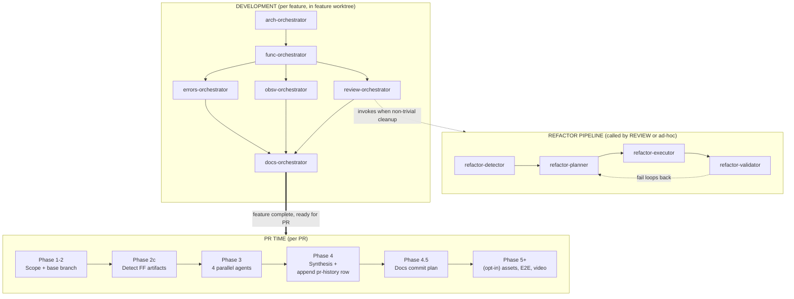
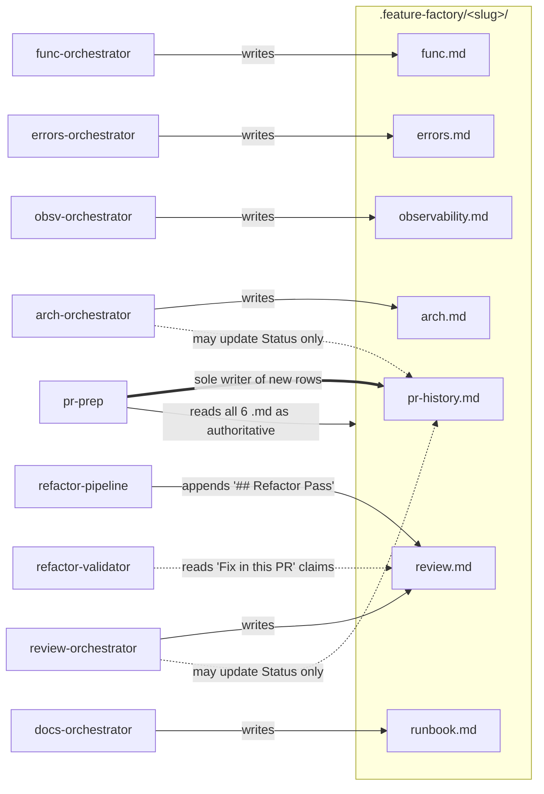
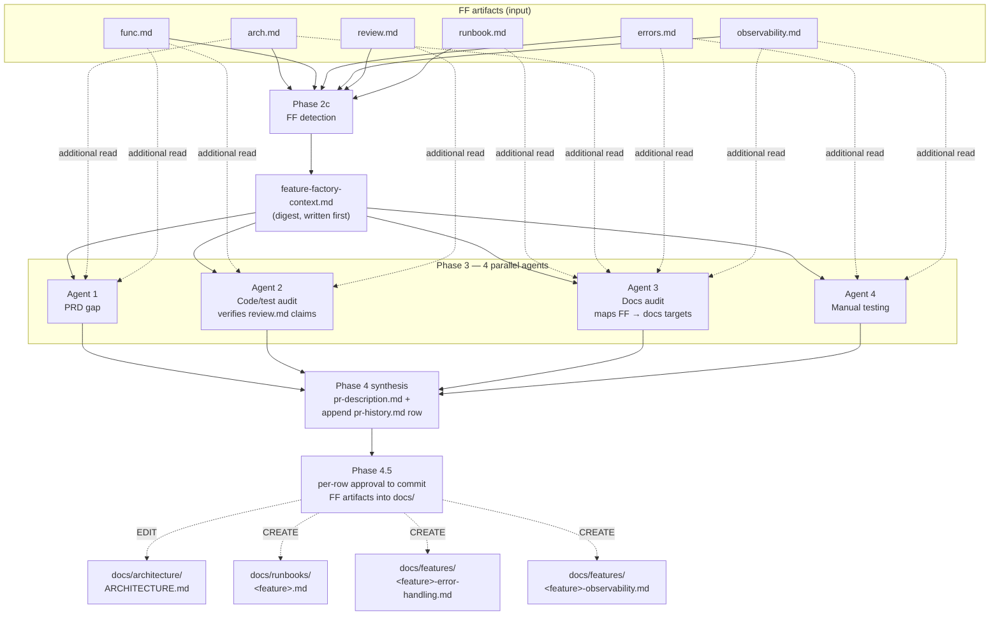

# Integration Diagrams: Feature Factory ↔ pr-prep ↔ refactor-pipeline

Four mermaid diagrams describing how the three skill families compose end-to-end. GitHub renders these natively. For an offline / self-contained view with the same diagrams, open [`diagrams.html`](./diagrams.html) in a browser.

Reading order if you're new to the wiring:
1. **Timeline** — when each skill family fires
2. **Ownership** — who writes what, who reads what
3. **pr-prep ↔ FF handshake** — how Phase 2c and Phase 3 consume FF artifacts
4. **refactor-pipeline ↔ FF** — the new 1.4.1 wiring

---

## 1. End-to-end timeline — when each skill family fires



---

## 2. Artifact ownership — who writes what, who reads what



Solid arrows = writes / reads. Bold double arrow = exclusive ownership. Dotted arrows = update-narrowly-only.

---

## 3. pr-prep ↔ FF handshake (Phase 2c → Phase 3)



---

## 4. refactor-pipeline FF-context decision (the 1.4.1 wiring)

```mermaid
flowchart TD
    Start([refactor-pipeline invoked]) --> Walk[Walk up from cwd<br/>find .feature-factory/]
    Walk --> Exists{".feature-factory/<br/>exists?"}
    Exists -->|no| OutA["Standalone:<br/>_refactor-output/&lt;ts&gt;/"]
    Exists -->|yes| Count{How many<br/>feature folders?<br/>(excluding reserved)}
    Count -->|0| OutB[".feature-factory/<br/>_refactor/&lt;ts&gt;/"]
    Count -->|1| Active[Active feature<br/>identified]
    Count -->|2+| Hist{Any pr-history.md<br/>has 'in-progress' or<br/>'open' top row?}
    Hist -->|exactly one| Active
    Hist -->|ambiguous| Ask[Ask the user<br/>which feature]
    Ask --> Active

    Active --> Append["Append to<br/>.feature-factory/&lt;slug&gt;/review.md<br/><br/>## Refactor Pass — YYYY-MM-DD<br/>scope / smells / SOLID / metrics / verdict"]
    Append --> Detail["Detail reports to<br/>.feature-factory/_refactor/&lt;ts&gt;/<br/>(smell-report.json, plan.md,<br/>validation-report.md)"]
    Detail --> Validate["refactor-validator<br/>cross-checks review.md<br/>'Fix in this PR' claims<br/>against the diff"]
    Validate --> Pass{All claims<br/>resolved?}
    Pass -->|yes| OK[PASS]
    Pass -->|"[CRITICAL]/[BLOCKER]<br/>unresolved"| Fail[FAIL]
    Pass -->|"[ISSUE]<br/>unresolved"| Notes[PASS WITH NOTES]
    Fail -. loops back .-> Active
```

---

## See also

- [`INTEGRATION_WITH_PR_PREP.md`](./INTEGRATION_WITH_PR_PREP.md) — the canonical integration spec (ownership rules, layout, dispositions)
- [`README.md`](./README.md) — the Feature Factory skill family overview
- [`USER_GUIDE.md`](./USER_GUIDE.md) — how to drive the pipeline as a user
